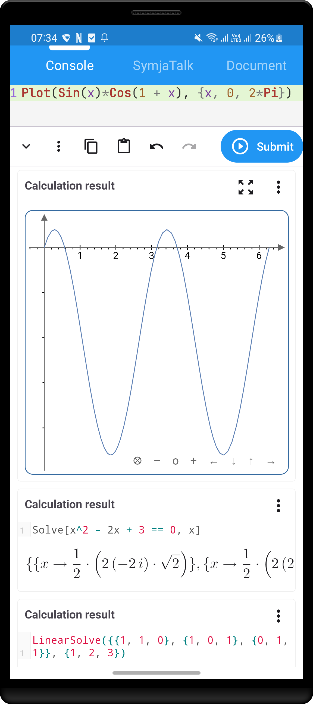
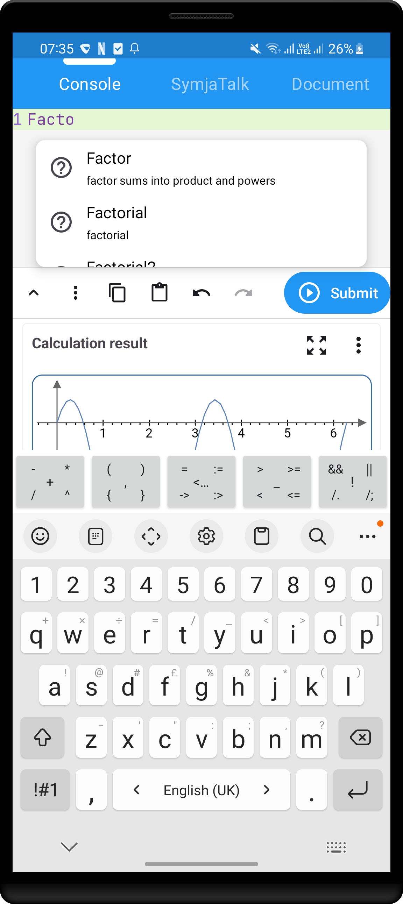
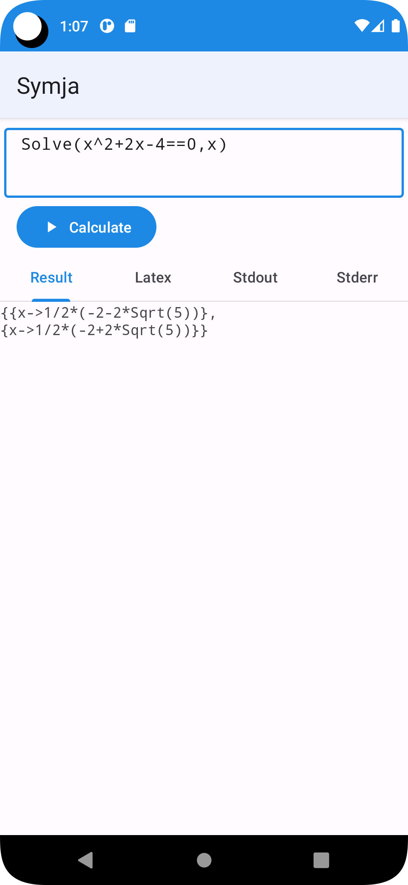
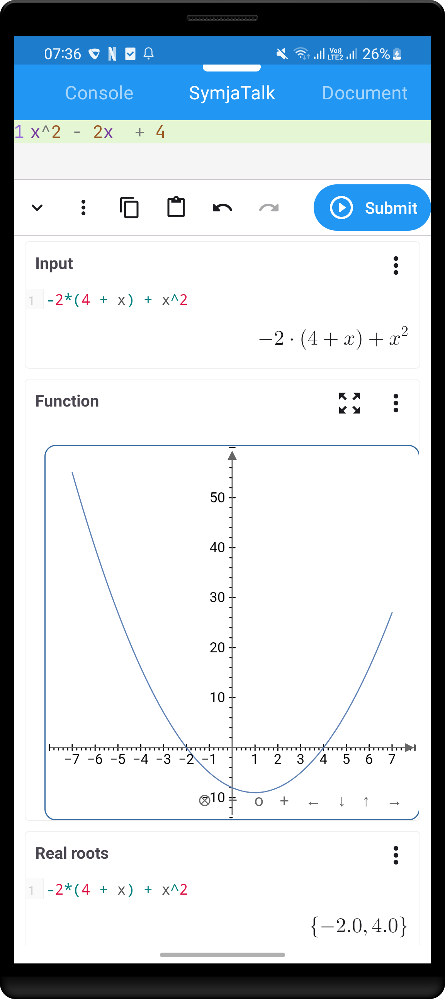
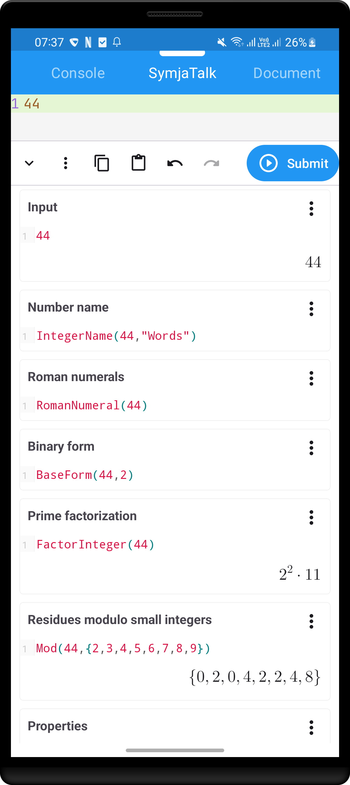
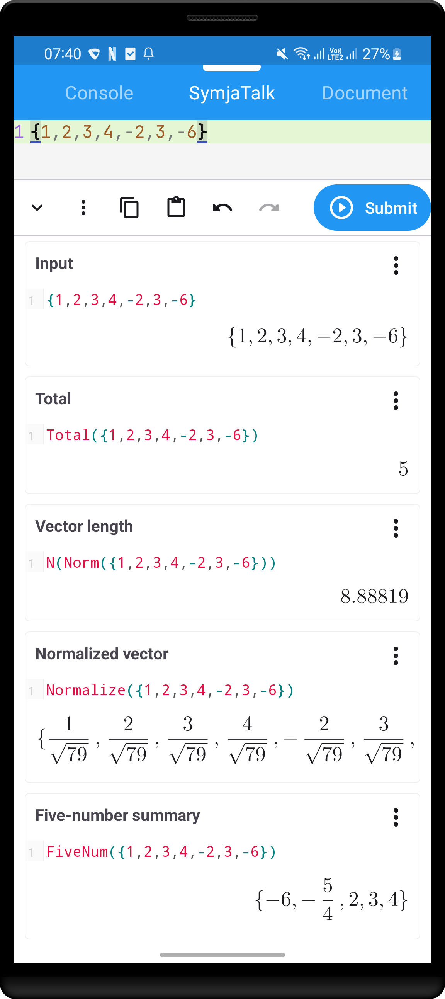
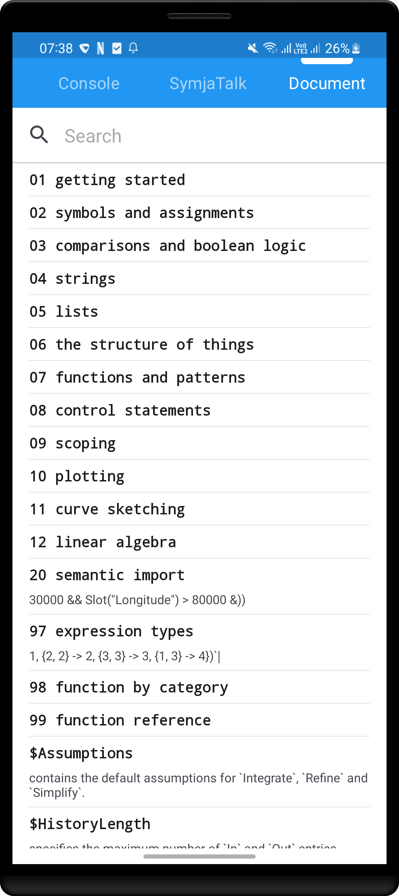
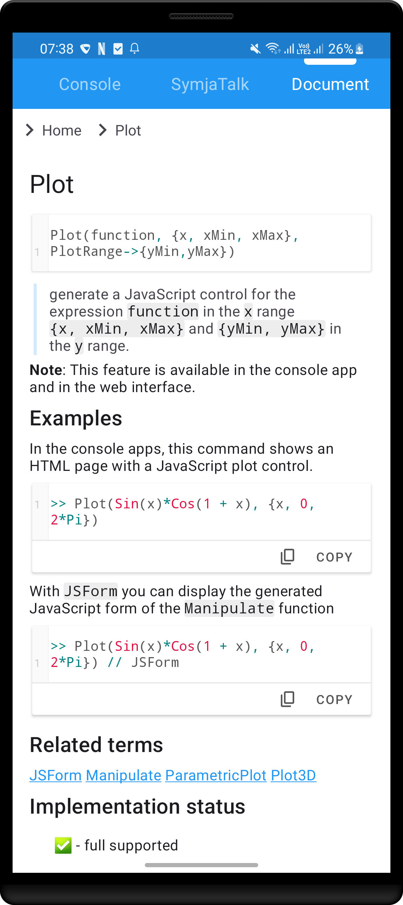
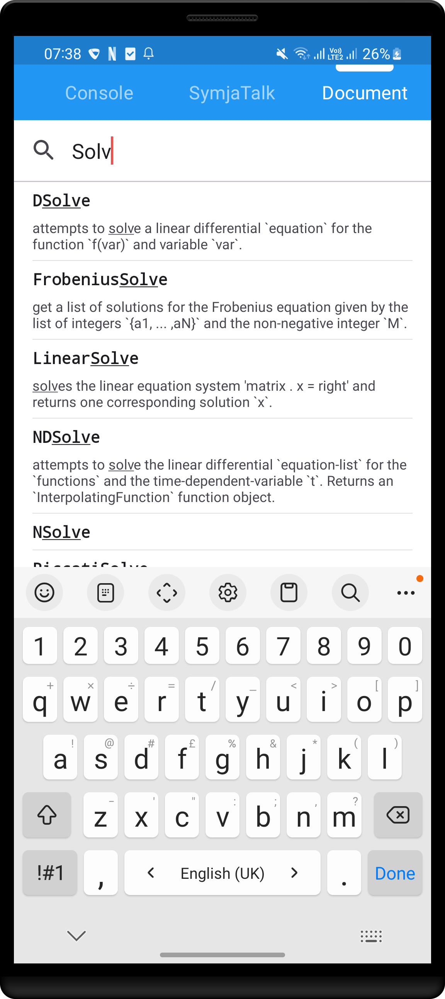
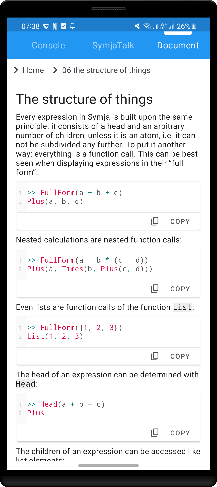

# Overview

This is an Android application for [Symja computer algebra language](https://github.com/axkr/symja_android_library)

# Features

## 1. Console





## 2. Symja Pods





## 3. Documentation







# Gradle Configuration

The repositories which are used by Gradle are defined here:
- https://github.com/axkr/symja-example/blob/main/settings.gradle

The Symja snapshots, which are used by this example app, are published with a Github Maven action, which could be monitored here:
- https://github.com/axkr/symja_android_library/actions
- https://oss.sonatype.org/content/repositories/snapshots/org/matheclipse/matheclipse-core/3.0.0-SNAPSHOT/

# Building

```shell
chmod +x gradlew
./gradlew assembleDebug
```
